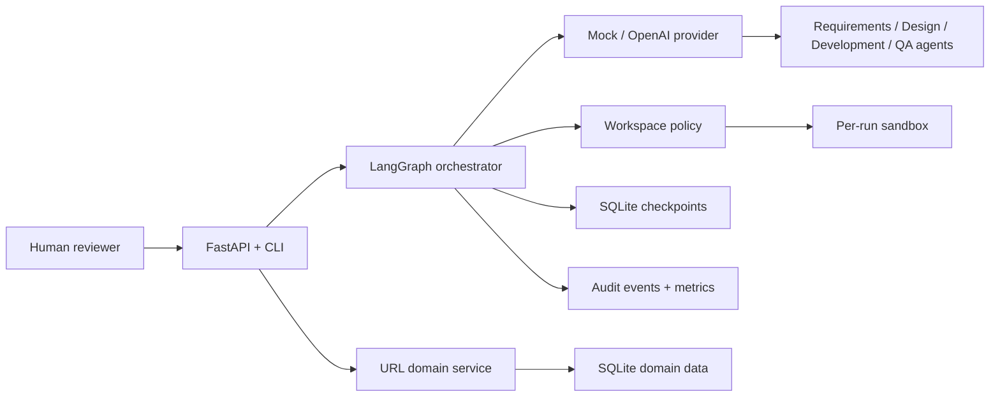
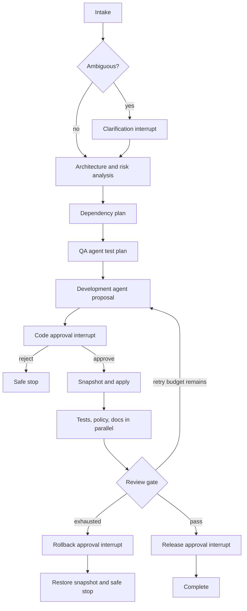

# Architecture Overview

## Components

The FastAPI application is the boundary for validated inputs. Domain and workflow state are
restart-safe in SQLite. Generated code can only enter a per-run sandbox after an interrupt is
approved. The main source tree is never an agent write target.

## Governed control flow

State contains requirement revisions, decisions, task dependencies, QA recommendations,
artifacts, approvals, attempts, validation results, rollback state, and terminal status. Audit rows preserve who did
what, when, why, and against which requirement revision.

Operational logs and audit records serve different purposes. Newline-delimited JSON logs support
runtime diagnosis and correlation; append-only SQLite audit events preserve governance decisions
and lineage. Audit events additionally record actor and requirement revision.

## Safety and reliability

- Inputs and model outputs are schema-validated and bounded.
- Paths are resolved and checked beneath the run root; absolute paths, traversal, and `.git`
  targets are rejected.
- Tests use a fixed command allowlist, isolated working directory, sanitized environment,
  timeout, captured output, and secret redaction.
- Retries are bounded. The initial sandbox snapshot is preserved across every retry so rollback
  restores the true pre-change state.
- Metrics expose success rate, retries, rollback, safe stops, MTTR placeholder, and p50/p95/p99
  end-to-end latency without high-cardinality labels.
